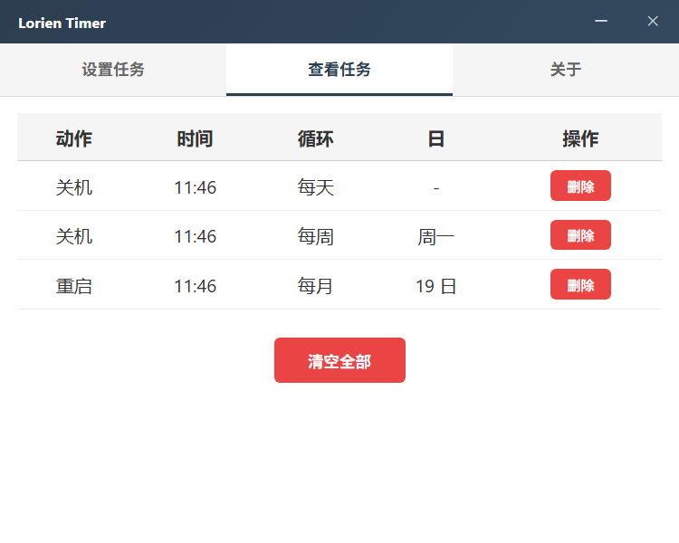

# Lorien Timer

> 一款轻量、高效的 Windows 定时关机/重启工具，基于 Tauri + Rust 构建

[](https://opensource.org/licenses/Apache-2.0)
[](https://www.microsoft.com/windows)
[](https://www.rust-lang.org)
[](https://tauri.app)
[](https://github.com/lu-xianseng/timer/releases)

## 项目简介

Lorien Timer 是一款专为 Windows 系统设计的定时任务工具，支持定时关机、重启等操作。项目进行 Tauri 框架重写，在保持原有核心功能的基础上，实现了更小的安装包体积、更低的运行时资源占用以及更现代化的用户界面。

- **极致轻量**：基于 Tauri 框架，安装包仅需数 1.59MB
- **Rust 驱动**：后端使用 Rust 编写，内存安全、无 GC 停顿，运行时资源占用极低
- **原生体验**：调用 Windows 系统 API 实现任务调度，与系统深度集成，稳定可靠
- **现代界面**：基于 Web 技术构建的流畅 UI

## 功能特性

- **定时任务设置**：轻松配置定时关机或重启任务
- **循环任务支持**：支持每天、每周、每月循环执行
- **任务管理**：查看任务列表，支持单个取消或批量取消操作
- **倒计时提醒**：到达设定时间后弹出倒计时提示窗口，避免闷头关机
- **多任务并行**：同时设置多个定时任务，互不干扰

## 技术栈

| 层级 | 技术 |
|------|------|
| 后端 | Rust + Tauri 2 |
| 前端 | Vanilla JavaScript + CSS |
| 数据库 | SQLite (via rusqlite) |
| 打包 | Tauri CLI |
| 目标平台 | Windows 10 / 11 |

## 快速开始

### 环境要求

- Rust 1.77+
- Node.js 18+
- Windows 10 / 11

### 构建

```bash
# 1. 安装 Tauri CLI
npm install -g @tauri-apps/cli

# 2. 安装 Rust 组件（仅首次）
rustup component add rust-src

# 3. 安装项目依赖
npm install

# 4. 开发模式运行
tauri dev

# 5. 构建发布版本
tauri build
```

## 与原版对比

| 特性 | 原版 (Python / PyQt5) | Lorien Timer (Rust / Tauri) |
|------|-----------------------|-----------------------------|
| 语言 | Python | Rust + JavaScript |
| GUI 框架 | PyQt5 | HTML / CSS / JS (Tauri) |
| 打包工具 | PyInstaller | Tauri CLI |
| 数据库 | SQLite3 | SQLite (rusqlite) |
| 任务调度 | win32com | schtasks API |
| 体积 | 30 MB | 1.6 MB |
| 内存占用 | 较高 | 较低 |
| 安全性 | 一般 | 内存安全 |


### 设置页面

通过时间点和循环日期设置系统重启和关机定时任务


### 任务管理

可对单个任务取消，也可以对所有任务进行全部取消



### 执行任务

可取消任务执行


## 许可证

本项目采用 [Apache License 2.0](https://opensource.org/licenses/Apache-2.0) 许可证 - 详见 [LICENSE](LICENSE) 文件。


