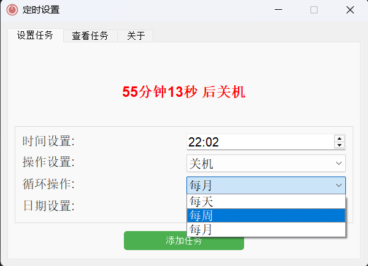

# 定时任务

一个设置 windows 系统的定时任务的程序（关机和重启）
帮助说明

▶ 设置定时任务 ：

您可以设置定时任务并激活它。到达预定时间点后，系统会弹出提示。如果您不处理提示，系统将在倒计时结束后执行操作。支持设置每天、每周、每月循环任务设定。

▶ 关闭或取消任务：

到达任务出发时间，系统将弹出倒计时提示，若点击"关闭"或"取消"按钮，定时任务将不会继续执行。定时任务可设置多个时间点任务

▶ 任务管理：

在查看任务界面，您可以对定时任务进行单个取消或批量取消操作。

# 设置页面

通过时间点和循环日期设置系统重启和关机定时任务

# 任务详情

可对单个任务取消，也可以对所有任务进行全部取消

